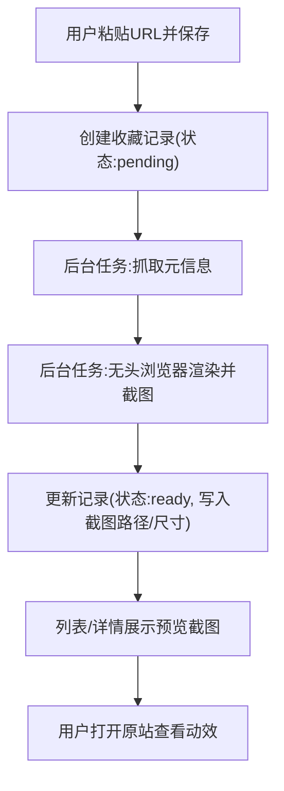

## 1. 产品概述
一个本地运行的“设计网页收藏库”：你只需要粘贴网址并保存，系统自动抓取标题/站点信息并生成高清预览截图，用于快速回看和学习。
- 目标用户：个人设计师/前端/产品，日常积累参考站点并快速检索回看
- 核心价值：最低输入成本（只给 URL），最大复盘效率（高质量预览 + 一键跳转原站）

## 2. 核心功能

### 2.1 用户角色
本地单人使用，不做复杂权限系统。

### 2.2 功能模块
1. **收藏列表**：卡片网格、搜索、筛选、排序、批量操作（可后续增强）
2. **新增收藏**：输入 URL（可选填写标签/备注），保存后异步生成预览
3. **收藏详情**：大图预览、元信息、一键打开原站、刷新预览、编辑标签/备注
4. **设置**：截图规格、并发/限速、本地数据导入导出（可后续增强）

### 2.3 页面详情
| 页面名称 | 模块名称 | 功能说明 |
|---|---|---|
| 收藏列表 | 顶部工具栏 | 新增按钮、搜索框、排序（最近新增/最近访问/域名） |
| 收藏列表 | 卡片网格 | 显示截图预览、标题、域名、标签；点击打开详情弹窗 |
| 收藏列表 | 空/加载状态 | 初次为空引导；后台生成中显示占位与进度状态 |
| 详情弹窗 | 预览区 | 显示高清截图（桌面为主，可扩展手机）支持缩放/全屏 |
| 详情弹窗 | 信息区 | 标题、站点名、favicon、URL、创建时间、生成状态 |
| 详情弹窗 | 操作区 | 打开原站、刷新预览、复制 URL、删除、编辑标签/备注 |
| 设置页 | 截图设置 | 视口宽高、DPR、是否自动滚动再截图（可选） |
| 设置页 | 数据管理 | 导入/导出 JSON、清空数据（可选） |

## 3. 核心流程
主要流程：
1) 用户粘贴 URL 保存 → 2) 进入“待生成”状态 → 3) 后端自动抓取元信息并生成截图 → 4) 前端列表自动更新显示预览 → 5) 用户点开大图预览或跳转原站查看动效

## 4. 用户界面设计

### 4.1 设计风格
- 整体：偏“编辑部/档案馆”气质的收藏系统，强调截图内容本身，UI 作为低噪声框架
- 颜色：深色底（煤黑/石墨灰）+ 单一高饱和强调色（电蓝或酸柠绿）用于状态与操作
- 字体：标题使用具有性格的衬线或窄体展示字体，正文使用易读的无衬线；避免过于常见的默认系统组合
- 布局：桌面优先，卡片网格为主；详情采用左右分栏（大图 + 信息/操作）
- 动效：轻量微交互（hover 浮起、加载骨架、状态渐入）；不做花哨的动效以免喧宾夺主

### 4.2 页面设计概览
| 页面名称 | 模块名称 | UI 元素 |
|---|---|---|
| 收藏列表 | 卡片网格 | 统一卡片比例、细描边、hover 浮起阴影、域名标签胶囊 |
| 收藏列表 | 顶部工具栏 | 搜索输入、排序下拉、新增按钮（强调色） |
| 详情弹窗 | 预览区 | 大图居中，支持缩放/全屏，背景遮罩降低干扰 |
| 详情弹窗 | 信息区 | 信息分组、状态标识（pending/ready/failed）清晰可见 |

### 4.3 响应式
桌面优先；移动端以单列卡片 + 全屏详情为主，保证可用但不作为首要优化目标。
