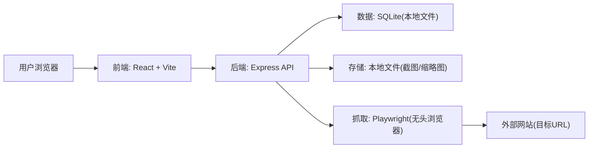
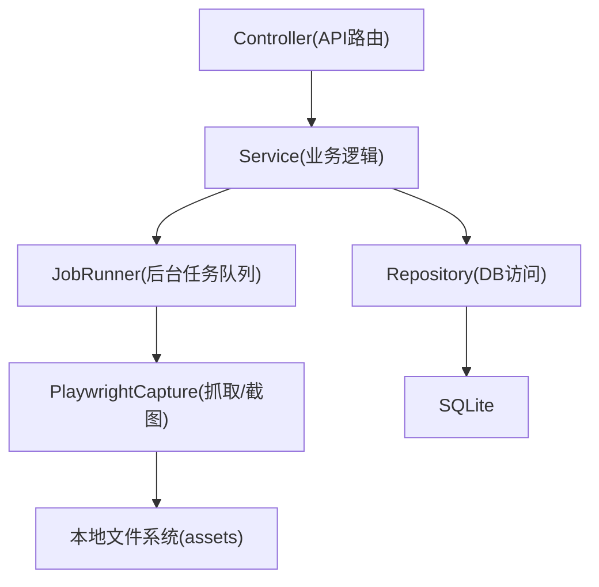
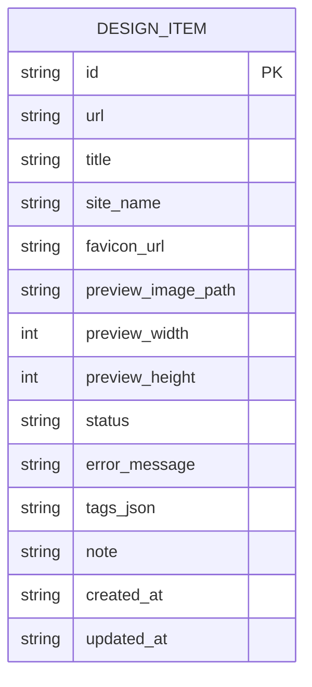

## 1. 架构设计



## 2. 技术说明
- 前端：React@18 + TypeScript + tailwindcss + react-router-dom + zustand
- 初始化工具：vite-init（使用 react-express-ts 模板）
- 后端：Express@4（ESM + TypeScript）
- 数据库：SQLite（本地单文件），用于存储收藏记录与抓取状态
- 抓取与截图：Playwright（Chromium），生成桌面高清截图（后续可扩展手机截图/自动滚动截图）
- 存储：本地目录保存截图文件，数据库仅存相对路径与尺寸信息

## 3. 路由定义
| 路由 | 用途 |
|---|---|
| / | 收藏列表（卡片网格 + 搜索/排序） |
| /settings | 设置（截图规格、数据导入导出） |

## 4. API 定义

### 4.1 数据类型
```ts
export type CaptureStatus = "pending" | "processing" | "ready" | "failed"

export type DesignItem = {
  id: string
  url: string
  title: string | null
  siteName: string | null
  faviconUrl: string | null
  previewImagePath: string | null
  previewWidth: number | null
  previewHeight: number | null
  status: CaptureStatus
  errorMessage: string | null
  tags: string[]
  note: string | null
  createdAt: string
  updatedAt: string
}
```

### 4.2 端点列表
| 方法 | 路径 | 用途 |
|---|---|---|
| GET | /api/items | 列出收藏（支持 search/sort） |
| POST | /api/items | 新增收藏（输入 url, tags?, note?），创建后进入 pending 并触发后台生成 |
| GET | /api/items/:id | 获取单条收藏详情 |
| PATCH | /api/items/:id | 更新 tags/note |
| POST | /api/items/:id/refresh | 重新抓取并刷新截图 |
| DELETE | /api/items/:id | 删除收藏及相关截图文件 |
| GET | /api/assets/* | 访问本地截图文件（静态托管） |

### 4.3 请求/响应概要
- POST /api/items
  - Request: `{ url: string, tags?: string[], note?: string }`
  - Response: `DesignItem`
- POST /api/items/:id/refresh
  - Response: `DesignItem`

## 5. 服务端架构图


## 6. 数据模型

### 6.1 ER 图


### 6.2 DDL（概念）
```sql
CREATE TABLE IF NOT EXISTS design_items (
  id TEXT PRIMARY KEY,
  url TEXT NOT NULL,
  title TEXT,
  site_name TEXT,
  favicon_url TEXT,
  preview_image_path TEXT,
  preview_width INTEGER,
  preview_height INTEGER,
  status TEXT NOT NULL,
  error_message TEXT,
  tags_json TEXT NOT NULL,
  note TEXT,
  created_at TEXT NOT NULL,
  updated_at TEXT NOT NULL
);

CREATE UNIQUE INDEX IF NOT EXISTS idx_design_items_url ON design_items(url);
CREATE INDEX IF NOT EXISTS idx_design_items_created_at ON design_items(created_at);
```
